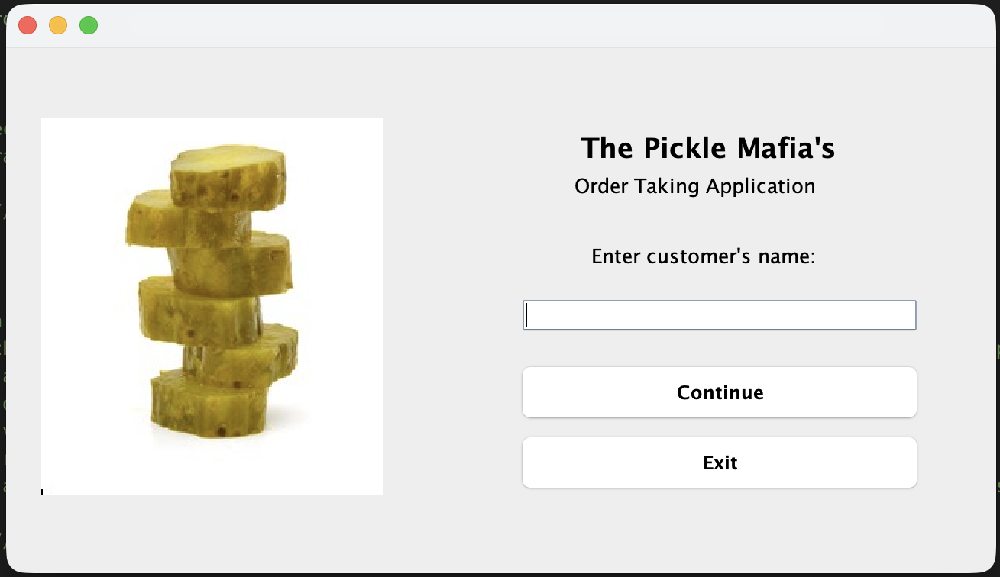
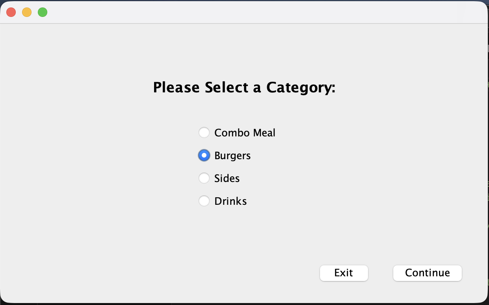
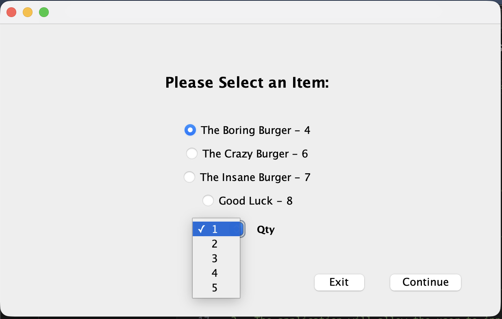
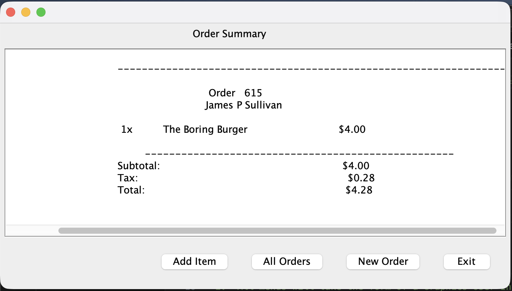

# Restaurant Order Taking Application (The Pickle Mafia)

A desktop GUI application built in Java that simulates a restaurant order-taking system. Order takers can input customer details, select menu items (including combo meals), validate inputs, calculate totals with tax, and generate order summaries. Orders are saved persistently to an external file.

**Semester Project** – Programming 2, Volunteer State Community College (Fall 2024)

## Features
- Multi-screen event-driven GUI using Java Swing
- Customer name input with validation
- Menu selection: Combo Meal, Burgers, Sides, or Drinks
- Combo meal flow with step-by-step category navigation (Burger → Sides → Drinks)
- Dynamic item selection with radio buttons populated from `system.txt`
- Quantity selection (1–5) and real-time order summary
- Automatic calculation of subtotal, 7% tax, and grand total
- View all previous orders from `summary.txt`
- Options to add more items, start a new order, or exit cleanly

## Technologies & Skills Demonstrated
- **Java** + Object-Oriented Programming (multiple classes, encapsulation)
- **Java Swing** – JFrame-based GUI, event handling, radio buttons, combo boxes, text areas
- **File I/O** – Reading menu data (`system.txt`) and appending orders (`summary.txt`) with BufferedReader/BufferedWriter
- **Data Structures** – ArrayList for menu items + custom data model class
- Regular expressions for price parsing in totals
- Random order number generation
- State management across multiple interconnected screens

## Project Structure
- `ThePickleMafiaApp.java` – Main entry point and shared file logic
- `OrderSummaryData.java` – Central data model handling orders, combos, and totals
- `SplashScreen.java` – Welcome screen with customer name input
- `MenuSelection.java` – Category and combo meal selection
- `ItemSelection.java` – Dynamic item selection with validation
- `OrderSummary.java` – Displays summary, totals, and navigation options

## Screenshots






## How to Run
1. Install **Java JDK 8 or higher**.
2. Place `system.txt` (menu items) in the project root.
3. Compile:
   ```bash
   javac *.java
4. Run:
   java ThePickleMafiaApp

## What I Learned

Building and connecting multiple GUI windows in an event-driven application
Managing complex application state (especially combo meal steps)
File persistence and data validation for a better user experience
Structuring larger OOP projects with separation of UI and logic

Developer: Parker L. Farris
Course: Programming 2 – Volunteer State Community College
Semester: Fall 2024
Repository: https://github.com/pfarris6116/PickleMafiaOTAFinalProject
